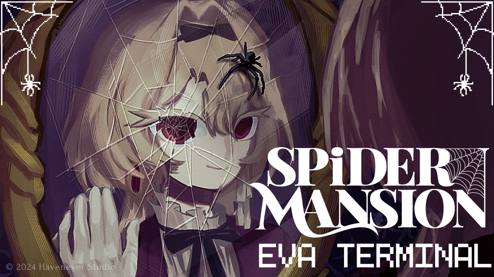

# Eva Terminal

[**Try this demo!**](https://eva-terminal-demo.onrender.com/)

**Participated in 2024 [Google AI Hackathon!](https://googleai.devpost.com/)**

[Check out this project on Devpost!](link to be added!)

## What is Eva Terminal About?
This game is a new take on the classic concept of *lateral thinking puzzle* games that challenge players to solve scenarios through questioning. 

At the heart of this game is the dynamic interaction between a game master, who provides the scenario, and a player, who asks questions to uncover the secrets.

### What Is A Lateral Thinking Puzzle Game?
A lateral thinking puzzle game is a verbal puzzle involving guessing the scenario by asking questions. 

The critical point of this game is conversation. For this game to work, we need the interaction of the game master, someone who provides a scenario, and the player, who asks questions to the game master to figure out the scenario. 

#### In Eva Terminal...
The AI(Eva) presents a scenario, and the player’s goal is to solve the puzzle by asking the AI yes or no questions related to the scenario, to which the AI can only respond with "Yes," "No," or "Doesn't relate."

### How We Built It
We integrated Gemini API data into a node.js application to create a chat-box-style terminal. This setup prompts Gemini with the necessary scenario setup and solution. The AI then evaluates the player's questions and provides relevant responses based on how closely they align with the correct answer.

##
### Dependencies

[Gemini API](https://ai.google.dev/)

[node.js](https://nodejs.org/)

##
### This Game Is Build From Havenever Studio's up Comming Game - *Spider Mansion*

#### Learn more about Spider Mansion!
[Spider Mansion Offical Website](https://spidermansion.cargo.site/)

[Spider Mansion Kickstarter](https://www.kickstarter.com/projects/havenever/spider-mansion)

[Spider Mansion Web Demo Git Hub Page](https://github.com/chanc245/SpiderMansionWebDemo)

#### Spider Mansion Social Media
* [Youtube](https://www.youtube.com/@SpiderMansionOffical)
* [Twitter](https://twitter.com/i/flow/login?redirect_after_login=%2Fspiderm4nsion)
* [Instagram](https://www.instagram.com/spidermansion.official/)

